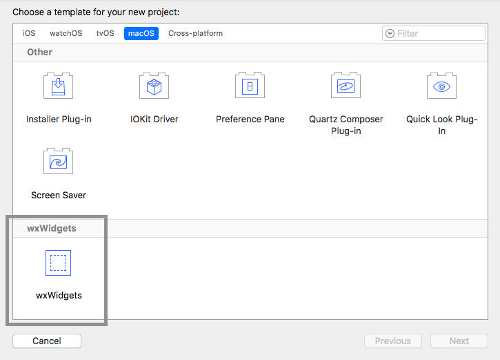

# wxWidgets-Xcode-Template
Xcode template for wxWidgets

### Requirements

* Xcode on Mac
* Homebrew Package Manager install from [brew.sh](https://brew.sh)
* wxWidgets from homebrew 
```
  brew install wxwidgets

```

### Install Template

* run install.sh script in terminal

### After install

* after install restart Xcode and you will see the template under macOS tab at the bottom inside wxWidgets section

<p align="center">
    
  </p>


### Licenses

* wxWidgets is currently licenced under The wxWindows Library Licence which approved by the Open Source Initiative.
* wxWidgets-Xcode-Template licensed under MIT License
